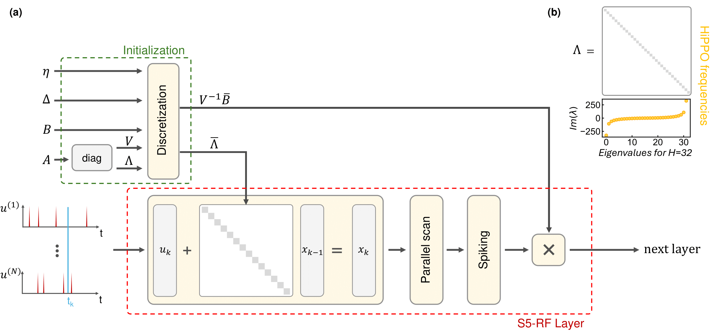

# S5-RF: Scaling Up Resonate-and-Fire Networks for Fast Deep Learning

Code to the paper.

The S5-RF combines the Resonate-and-Fire (RF) neuron with the SSM [S5](https://github.com/lindermanlab/S5) by leveraging the frequency and decay initialization and the parallel scan as efficient computation algorithm.
With a discretization adjusted for spikes, the S5-RF achieves state-of-the-art results on SSC for recurrent SNNs and results comparable to LIF neurons on other spiking and non-spiking benchmarks. By dropping the refractory period, training on GPU could be drastically minimized while still mainting a favorable sparse outputs. 


<p style="text-align: center;">
(a) Architecture of a S5-RF layer. The spike input is processed by a layer of RF neurons. Internal sub-threshold dynamics are computed with parallel scans. Spikes are computed afterwards. 
(b) Imaginary part of the neurons' eigenvalues which correspong to the frequency.  
</p>

## System and Build Requirements
This code requres the following:
- Linux (for JAX gpu acceleration)
- Python >= 3.9 (for Equinox) 
- Wandb account (for logging)

It is tested on the following system specification:
- Ubuntu 22.04
- Python 3.10.12
- Cuda 12.4


## Installation
This implementation is based on [JAX](https://github.com/jax-ml/jax) and [Equinox](https://github.com/patrick-kidger/equinox). It is worth mentioning that, as of now, JAX requires Linux to operate on a GPU. 

After creating and activating a virtual envirenment (e.g. with virtualenv), run on root level ```pip install -r requirements.txt```. This should install all necessary packages. As the installation of JAX, especially with Cuda support, can be cumbersome, we point towards the [installation guide](https://jax.readthedocs.io/en/latest/installation.html). We recommend installing JAX first. 

## Running Experiments
Experiments on sMNIST, psMNIST, SHD and SSC can be executed by running, for example
```
source bin/run_sMNIST.sh
```
from the `s5rf` directory. This downloads the benchmark's data and trains a S5-RF model with the parameters provided. Results are logged by wandb.
Similar customizable scripts exist for the other benchmark datasets under `./s5rf/bin/`. 

